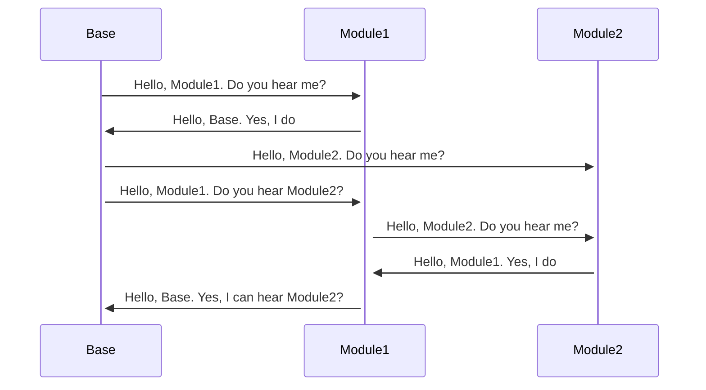
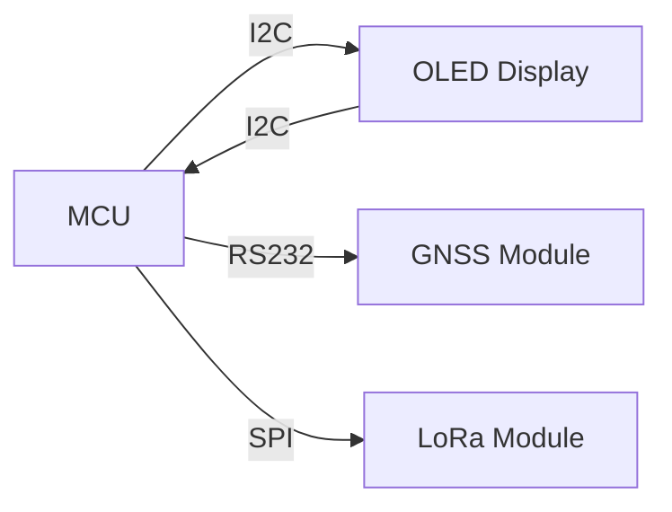

# GPS tracker system

GPS tracker system based on LoRa transceiver.

# Hardware

* GNSS Module RYS8830 Datasheet: http://reyax.com/tw/wp-content/uploads/2020/02/RYS8830.pdf
* Transceiever LoRa
* MCU: STM32L051KB6
* OLED streen

# System overview

# Module overview

# Software

# Communication protocol

* In progress...

## Release History

* 0.0.1
    * Work in progress

## Meta

Your Name - Ilya Deryabin

## Contributing

